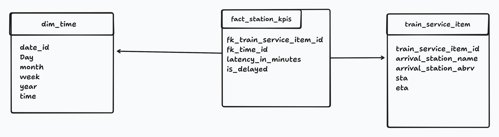

# Data Model Documentation: [Train station data]

## 1. Overview
> **Description:** To track train delays and optimize station scheduling by analyzing latency trends and delay frequencies.

## 2. Schema Diagram

## 3. Tables Definition

### Table: `fact_train_activity`
* **Type:** Transactional Fact Table
* **Granularity:** One row per individual train stop at a station.
* **Purpose:** Captures the raw performance metrics for every train arrival.

| Column Name | Data Type | Description |
| :--- | :--- | :--- |
| `activity_id` | `BIGINT` | Primary Key. |
| `fk_train_service_item_id` | `INT` | Foreign Key to `train_service_item` (Links to schedule details). |
| `fk_time_id` | `INT` | Foreign Key to `dim_time` (Links to Actual Arrival Time). |
| `latency_minutes` | `INT` | **Metric:** Difference between Actual Arrival and Scheduled Arrival in minutes. |
| `is_delayed` | `INT` | **Metric:** `1` if `latency_minutes > 0`, otherwise `0`. Facilitates simple sum aggregations for delay counts. |

### Table: `train_service_item`
* **Type:** Dimension
* **Purpose:** Stores attributes related to the specific scheduled service, including planned times and route info.

| Column Name | Data Type | Description |
| :--- | :--- | :--- |
| `train_service_item_id` | `INT` | Primary Key. |
| `arrival_station_name` | `VARCHAR` | Name of the station (e.g., "London Waterloo"). |
| `arrival_station_abrv` | `VARCHAR` | CRS Code (e.g., "WAT"). |
| `sta` | `DATETIME` | **Scheduled Time of Arrival** (The target time). |
| `eta` | `DATETIME` | **Estimated Time of Arrival** (Snapshot of expectation). |
| `operator` | `VARCHAR` | Train Operator (e.g., "Southern"). |

### Table: `dim_time`
* **Type:** Dimension
* **Purpose:** Calendar reference table for slicing data by time periods.

| Column Name | Data Type | Description |
| :--- | :--- | :--- |
| `date_id` | `INT` | Primary Key. |
| `Day` | `VARCHAR` | Day name (e.g., "Monday"). |
| `month` | `INT` | Month number (1-12). |
| `week` | `INT` | Week number of the year. |
| `year` | `INT` | Year (e.g., 2023). |
| `time` | `TIME` | Time of day buckets. |

## 4. KPI Calculation Logic (Slicing Strategy)

The Fact Table stores atomic events. KPIs are derived by slicing these events:

1.  **Average Latency (Last 30m)**
    *   **Slice:** Filter `fk_time_id` or `actual_arrival` for the last 30 minutes.
    *   **Group By:** `arrival_station_name`.
    *   **Calc:** `AVG(latency_minutes)`.

2.  **Peak Days of the Week**
    *   **Slice:** All time.
    *   **Group By:** `dim_time.Day`.
    *   **Calc:** `AVG(latency_minutes)` (Find the day with the max average).

3.  **Number of Delays**
    *   **Slice:** By Station or Global.
    *   **Calc:** `SUM(is_delayed)`.
